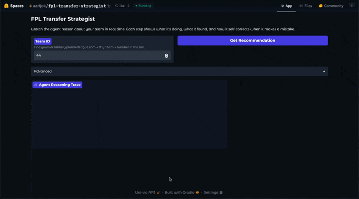
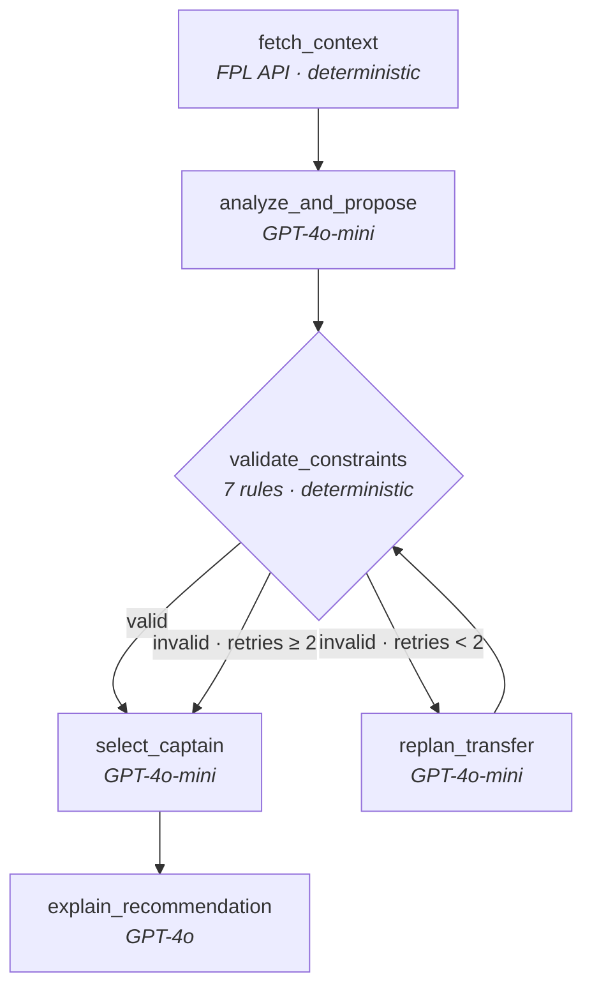

# FPL Transfer Strategist

Fantasy Premier League transfer agent with a visible self-correction loop — deterministic constraint validation triggers autonomous replanning. Built with LangGraph.

[](https://github.com/aarijokhan/fpl-strategist/actions/workflows/test.yml)
[](https://huggingface.co/spaces/aarijok/fpl-transfer-strategist)


<p align="center">
  
</p>

[Try it live →](https://huggingface.co/spaces/aarijok/fpl-transfer-strategist)

## Architecture



## How It Works

1. **Fetch context** — pulls your squad, budget, fixtures, and form from the live FPL API. Ranks ~600 players into a candidate shortlist using a form-weighted composite score.
2. **Analyze & propose** — GPT-4o-mini evaluates squad weaknesses against upcoming fixtures and proposes one transfer (or hold). It focuses purely on football intelligence; constraints are not its job.
3. **Validate & replan** — a deterministic constraint engine checks 7 rules (budget, team limit, position match, availability, squad membership, player existence, no self-swap). If the proposal fails, the agent replans with the violation feedback — up to 2 retries. This is the visible self-correction loop.
4. **Captain & explain** — picks a captain/vice-captain, then GPT-4o writes a natural-language recommendation grounding every claim in the data it saw.

## Key Design Decisions

- **Deterministic constraint node.** Validation is pure Python, never LLM-based. If the LLM validated its own proposals, violations would never surface — the replan loop would be decorative.
- **Loose candidate filter.** The filter ranks by form and fixtures but does *not* exclude unavailable players or enforce team limits. Invalid candidates reach the LLM, get proposed, fail validation, and trigger the replan loop. Tightening the filter would make the self-correction centerpiece unreachable.
- **Two model tiers.** GPT-4o-mini for the fast, structured nodes (analyze, replan, captain). GPT-4o for the final explanation where prose quality matters. Keeps cost under $0.05/run.
- **Structured output via Pydantic.** All data-returning LLM nodes use `with_structured_output()` with Pydantic response models. No manual JSON parsing.

## Evaluation Results

21-gameweek backtest (GW 5–25, team 44) comparing the agent against a heuristic baseline (form × fixture difficulty composite):

| Metric | Agent | Heuristic |
|--------|-------|-----------|
| Transfer delta (pts/GW) | **-1.0** | **+1.7** |
| Captain delta (pts/GW) | **-0.4** | **-1.3** |
| First-attempt valid rate | 57% | — |
| Replan loop fired | 43% of GWs | — |

**What works:** The replan loop is genuinely load-bearing — 43% of initial proposals failed validation and were self-corrected. The constraint engine catches real violations. Captaincy picks are competitive.

**What doesn't:** Agent transfers underperform the heuristic (-1.0 vs +1.7 pts/GW). The agent over-trades (81% transfer rate) and routinely sells established players for speculative picks that blank.

**What this proves:** The evaluation framework — backtesting with leakage prevention, a heuristic baseline, and an LLM-as-judge — surfaces real weaknesses. Most portfolio projects don't measure whether they work. This one does, and the answer is honest.

Full results and analysis: [docs/backtest_results.md](docs/backtest_results.md)

## What I Learned

- **The replan loop is load-bearing, not decorative.** 43% of initial proposals failed validation. Without the loop, nearly half of all runs would produce invalid recommendations. Keeping candidate filtering deliberately loose and closing the loop through replanning is what makes this an agent, not a pipeline.

- **A heuristic baseline is the most humbling artifact you can build.** The agent underperforms a simple form×fixture composite on transfers. The LLM's reasoning reads well but doesn't translate to better decisions — a widely observed phenomenon in LLM-based decision systems worth knowing before shipping one to production.

- **Same-family LLM-as-judge is not evaluation.** GPT-4o judging GPT-4o-mini produced a 0.33-sigma distribution over a 1–5 scale — the judge scored the agent's worst decisions at 5.0. The infrastructure works; the scores are uninformative without cross-lineage evaluation.

- **Structured output eliminates a category of bugs, except for prose.** `with_structured_output()` on data-returning nodes eliminated JSON parsing issues entirely. Applying it to the explanation node degraded prose quality — the LLM truncated paragraphs to fit the JSON structure.

- **Build the eval harness before tuning prompts.** I tuned prompts by reading output for four phases before building automated scoring. Every change was guesswork. The eval harness should have been Phase 3, not Phase 6.

## Tech Stack

| Layer | Tools |
|-------|-------|
| Agent framework | LangGraph |
| LLMs | GPT-4o-mini (analyze, replan, captain), GPT-4o (explain) |
| Structured output | Pydantic v2 + `with_structured_output()` |
| Data | async httpx + tenacity retry, live FPL API |
| Web UI | Gradio |
| Tracing | Langfuse (optional) |
| Evaluation | Custom backtest harness, heuristic baseline, LLM-as-judge |
| Tests | pytest + respx mocks, VCR cassettes for LLM calls |
| CI | GitHub Actions |

## Local Setup

```bash
git clone https://github.com/aarijokhan/fpl-strategist.git
cd fpl-strategist
uv venv .venv && source .venv/bin/activate
uv pip install -e ".[dev]"

# Copy .env.example → .env and add your OpenAI API key
cp .env.example .env

# Verify data layer (no LLM needed)
python -m fpl_strategist.main inspect 44

# Full agent run
python -m fpl_strategist.main recommend 44 --verbose

# Run tests
python -m pytest tests/ -v
```

<details>
<summary>Project Structure</summary>

```
src/fpl_strategist/
├── data/           # FPL API client (async httpx + tenacity), Pydantic models, candidate filter
├── constraints/    # Deterministic transfer validation engine (7 rules)
├── nodes/          # One file per LangGraph node (fetch_context, analyze, validate, replan, captain, explain)
├── eval/           # Backtesting harness, scoring, heuristic baseline, LLM-as-judge
├── main.py         # Typer CLI (inspect, recommend, backtest)
├── state.py        # LangGraph FPLState TypedDict
├── graph.py        # LangGraph graph definition with conditional routing
├── llm.py          # LLM provider setup (OpenAI / Anthropic)
tests/              # pytest + respx mocks, VCR cassettes, one test file per module
app.py              # Gradio web UI
app_helpers.py      # HTML/card builders for UI components
docs/               # PRD, architecture walkthrough, backtest results
```

</details>

## Further Reading

- [Architecture Walkthrough](docs/WALKTHROUGH.md) — detailed trace through every node with code references
- [Backtest Results & Analysis](docs/backtest_results.md) — full 21-GW evaluation with per-gameweek breakdown
- [Product Requirements](docs/PRD.md) — original PRD with phase-by-phase implementation plan
